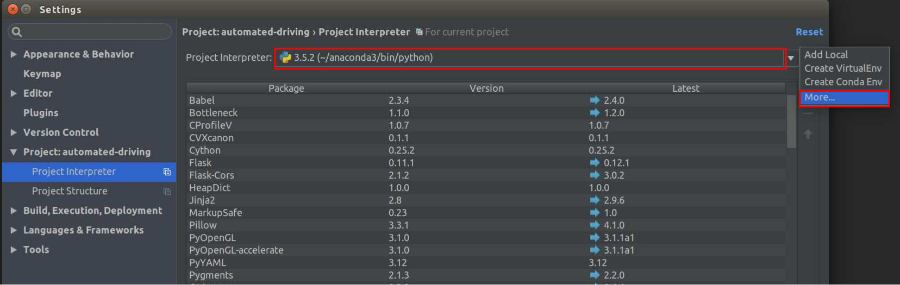
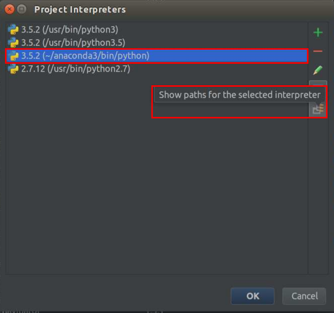
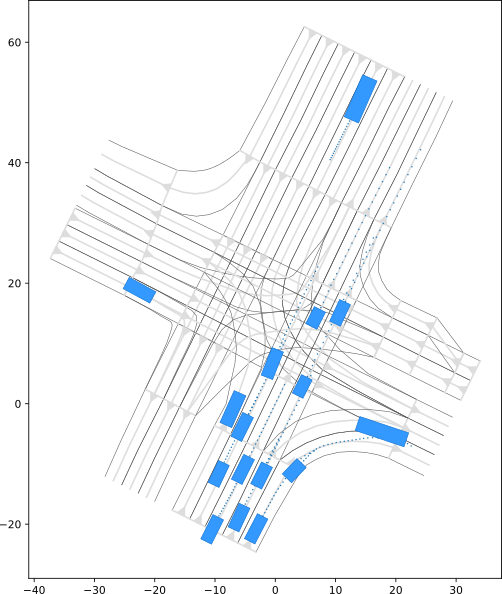
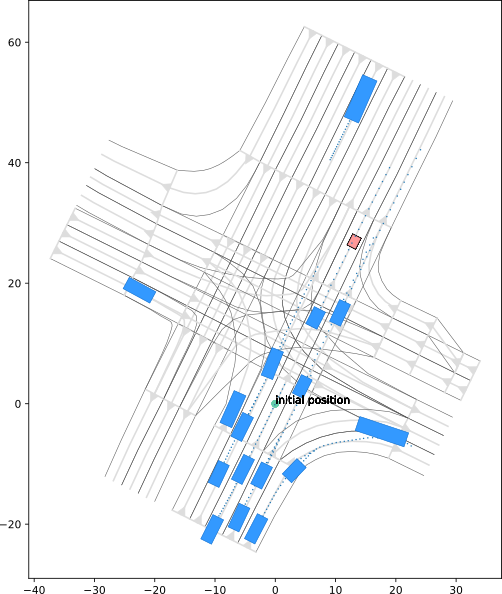
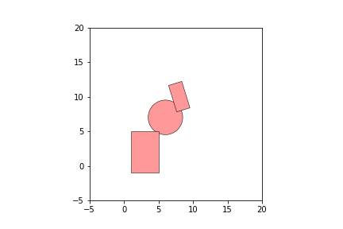
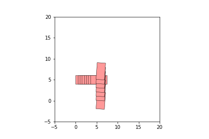
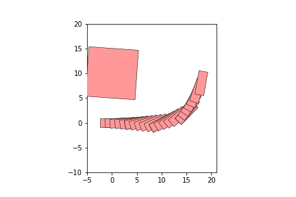
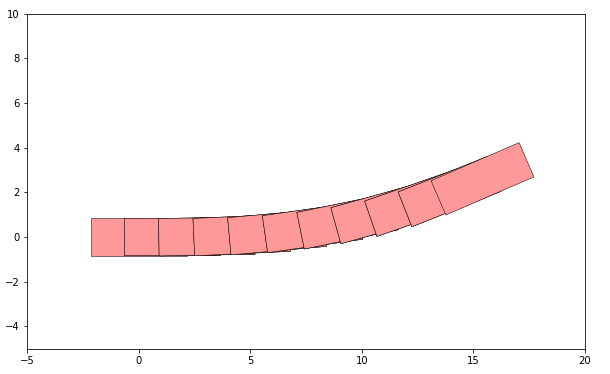

.. fvks documentation master file, created by
   sphinx-quickstart on Thu Apr 20 18:39:02 2017.
   You can adapt this file completely to your liking, but it should at least
   contain the root `toctree` directive.

.. toctree::
   :maxdepth: 2
   :caption: Contents:

Overview
========
The repository contains Python modules to open a CommonRoad traffic scenario, basic visualization functionality and a collision checker. The collision checker performs intersection tests for basic geometric shapes (e.g. rectangles, circles) and time-varying collision objects (e.g. moving cars). The collision checks are written in C++ and are available through a Python wrapper.

Dependencies
============
Before you install the Python software, please download the CommonRoad repository available at http://commonroad.in.tum.de. There you can find different traffic scenarios stored as XML-files and various vehicle models. A detailed description can be found in the folder commonroad/documentation/. After the download, you should have following folder structure:

.. code-block:: text

    project/
    ├-automated-driving/
    └-commonroad/

The CommonRoad repository is now ready to use; however, the C++ modules and the Python wrapper from the automated-driving repository have to be compiled.

Installation of automated-driving
=================================

The repository contains one CMake project which builds the C++ collision checker library and its Python wrapper.

- The requirements for the **collision checker library** are: **C++11 compiler** and **CMake**
- The requirements for the **Python wrapper** are: **C++11 compiler**, **CMake** and **Python 3 with development headers**

The usage of the *Anaconda* Python distribution is strongly recommended (see http://www.anaconda.com/download/#download). It is maybe necessary to update *libgcc* after the installation of *Anaconda*:

.. code-block:: text
	
	$ conda update libgcc

Currently the software has been tested on recent versions of OS X and Linux. Windows is not supported at the moment and requires (most probably) adjustments in the Python wrapper CMakeLists.txt.

To build the project with CMake execute the following steps in the terminal::

    $ cd project/automated-driving/
    $ mkdir build
    $ cd build
    $ cmake -DPYTHON_INCLUDE_DIR="/path/to/python/include/python3.5m" ..
    $ make

Please note that the variable PYTHON_INCLUDE_DIR must point to the header files of your desired Python installation.

PyCharm IDE
===========

The usage of the Python IDE PyCharm from JetBrains is recommended (see http://www.jetbrains.com/pycharm/). 

After the installation of PyCharm, you can configure the project in a few steps. Begin by opening your existing project which can be done by clicking Open Project on the Welcom screen of PyCharm. Now, you should see following structure in your project tree in PyCharm:

.. code-block:: text

	project/
	├-automated-driving/
	├-commonroad/
	└-your-repository/
	External Libraries/

Second, you have to select the project interpreter. Open therefore the File/Settings/ dialog box, and click Project:repository/Project Interpreter. You should choose the same Python installation as you have used in section Installation_of_automated_driving_. 

Next, the project interpreter has to be configured in order to use the C++ library and CommonRoad vehicle models. Therfore choose More/ as shown in the figure below.

In the python interpreter's dialog box, choose your interpreter again and click "Show paths for selected interpreter". You have to add following paths:

1. project/automated-driving/python 
2. project/automated-driving/build 
3. project/automated-driving/build/python_binding
4. project/commonroad/vehicleModels/Python

You should now be able to use the provided Python modules in PyCharm. You can use the same procedure to add your own repository, e.g.:

.. code-block:: text

	project/
	├-automated-driving/
	├-commonroad/
	└-your-repository/
	External Libraries/

You only have to add the path project/your_repository to the interpreter paths.

Get Started
===========

In this section, the most important features of automated-driving are explained. You can find all examplary code snippets which are used below in project/automated-driving/tutorial as Jupyter Notebooks. You can find a description how to execute a Jupyter Notebook here: http://www.jetbrains.com/help/pycharm/using-ipython-jupyter-notebook-with-pycharm.html. 

Class: CommonRoadFileReader
---------------------------

A scenario represents the environment including a set of obstacles (other cars, walls, ...) and a network of lanes. A lane is built from lane segments ("lanelets"), that can be connected to form arbitrary lane networks. As already mentioned before, the scenarios a stored in the CommonRoad XML-format (a detailed description can be here http://commonroad.gitlab.io or in project/commonroad/documentation/XML_commonRoad.pdf). 

You can read a scenario from CommonRoad using the :py:class:`fvks.scenario.commonroad.file_reader.CommonRoadFileReader` (see project/automated-driving/tutorial/scenario.ipynb):

.. code-block:: python

	import os
	import matplotlib.pyplot as plt

	from fvks.visualization.draw_dispatch import draw_object
	from fvks.scenario.commonroad.file_reader import CommonRoadFileReader

	filename = '/commonroad/scenarios/NGSIM/Lankershim/NGSIM_Lanker_1.xml'

	scenario = CommonRoadFileReader(os.getcwd() + filename).open_scenario()

	plt.figure(figsize=(25, 10))
	draw_object(scenario)
	plt.gca().set_aspect('equal')
	plt.show()

    An intersection scenario *NGSIM_Lanker_1* from CommonRoad

There might be dynamic obstacles in the scenario. To go forward or backward in time, you can set the time of the scenario, e.g. time step 30, and plot it:

.. code-block:: python

	scenario.set_time(30)

	plt.figure(figsize=(25, 10))
	draw_object(scenario)
	plt.gca().set_aspect('equal')
	plt.show()

Please note that within all modules of automated-driving the time is discretized, and only time steps are used (thus multiples *scenario.dt*).

A motion planning problem does not only consist of a scenario, but also of an initial state and a goal region for the ego vehicle (vehicle for which motion planning is conducted). Furthermore, there might be more than one ego vehicle for which the motion has to be planned. We thus have one planning task with at least one planning problem. 

The :py:class:`fvks.scenario.commonroad.file_reader.CommonRoadFileReader` provides the functionality to read the scenario and the planning task:

.. code-block:: python

	scenario, planning_task = CommonRoadFileReader(os.getcwd() + filename).open()

	plt.figure(figsize=(25, 10))
	draw_object(scenario)
	draw_object(planning_task)
	plt.gca().set_aspect('equal')
	plt.show()

    An intersection scenario *NGSIM_Lanker_1* from CommonRoad with one ego vehicle. The goal position is plotted as red rectangle.

Class: Scenario
---------------

.. py:class:: fvks.scenario.Scenario

	.. py:attribute:: dt

	Time discretization of scenario

	.. py:class:: lanelet_network
		
		.. py:attribute:: lanelets

	Stores the lanelets; can be used to query lanelets by ids

	.. py:attribute:: benchmark_id

	Unique benchmark ID from CommonRoad

The class :py:class:`fvks.scenario.Scenario` provides methods to rotate and translate a scenario, to add new objects, and to query the obstacles.

Class: Lanelet
--------------

Each lanelet stores its left and right boundary and its center by a polyline (a list of vertices).

.. py:class:: fvks.scenario.Lanelet

	.. py:attribute:: lanelet_id

	ID to identify the lanelet

	.. py:attribute:: left_vertices

	List of vertices of the left border

	.. py:attribute:: right_vertices

	List of vertices of the right border

	.. py:attribute:: center_vertices

	List of vertices of the center of the lane

	.. py:attribute:: successor

	List of lanelet IDs of successor lanelets

	.. py:attribute:: predecessor

	List of lanelet IDs of predecessor lanelets

	.. py:attribute:: adj_left

	ID of left adjacent lanelet

	.. py:attribute:: adj_right

	ID of right adjacent lanelet

	.. py:attribute:: adj_left_same_direction
	
 	ID of left adjacent lanelet with same driving direction

	.. py:attribute:: adj_right_same_direction

	ID of right lanelet with same driving direction

If a lanelet A is the successor of another lanelet B, the first (center/left/right) point of A coincides with the last (center/left/right) point of B. More necessary conditions on lanelets can be found in project/commonroad/documentation/XML_commonroad.pdf.

Class: Obstacle
---------------

There are three major categories of obstacles:

- Static obstacles (two-dimensional regions),
- Time-variant obstacles (two-dimensional regions which change over time),
- Obstacles described by a trajectory (position, orientation, ... at different points in time) of the object.

An obstacle defines a two-dimensional region, which must not be touched. The time of all obstacles is discretized with the same time step. Furthermore, each obstacle is assigned:

.. py:class:: fvks.scenario.Obstacle

		.. py:attribute:: obstacle_id
		
		ID to identify the obstacle

		.. py:attribute:: obstacle_role
		
		the role static or dynamic

		.. py:attribute:: obstacle_type
		
		the type, e.g car/truck/.../unknown.

Obstacles can be tested if they collide with each other. The collision check is implemented in the C++ library, but can be called in Python. All objects which may tested for collisions are of type fvks::collision::CollisionObject. In order to test an obstacle for collisions, a CollisionObject must be created by calling the member function "create_collision_object()" of the obstacle. A detailed description to perform collision checks of "CollisionObject"s can be found in section: Collision checker.

Static and time-variant obstacles
~~~~~~~~~~~~~~~~~~~~~~~~~~~~~~~~~

A static obstacle is the most simple one. Its shape can be either:

- A triangle,
- an oriented rectangle,
- an axis-aligned rectangle
- a circle,
- or an arbitrary finite union of the three shape above (e.g. a triangle mesh).

A time-variant obstacle is defined by a shape, which depends on time. For each point in time a shape is assigned similar to static obstacles. A time-variant obstacle may start at any time index. For example it can be defined for the time steps 4-7 like:

Time step 4: A polygon

Time step 5: a polygon

Time step 6: a circle

Time step 7: a circle, two oriented rectangles and a polygon

Empty time steps in between are currently not allowed (for example leaving out time step 5 above):

Obstacles given by a trajectory
~~~~~~~~~~~~~~~~~~~~~~~~~~~~~~~

Moving vehicles are represented by their trajectories. A trajectory contains a list of states (position, orientation, ...) of the vehicle for each time step:

.. py:class:: fvks.scenario.Trajectory

		.. py:attribute:: t0
		
		Time index when trajectory starts

		.. py:attribute:: state_list
		
		List of states for each time step (time index of state is t0 + list index of state)

		.. py:attribute:: state_tuple
		
		Describes the composition of the state

The composition of states is not fixed and can be defined by the user. This is for example necessary, if one uses different vehicle models with different states for motion planning. Therefore, the :py:class:`fvks.scenario.trajectory.StateTupleFactory` is introduced. There you can find the set of allowed states (currently all states necessary for the CommonRoad vehicle models are supported). If you need a state containing the position, orientation and velocity, you can execute:

.. code-block:: python

	# Create a state tuple
	import numpy as np
	from fvks.scenario.trajectory import StateTupleFactory

	state_tuple = StateTupleFactory.create_state_tuple(StateTupleFactory.position, 
		                                           StateTupleFactory.orientation, StateTupleFactory.velocity)
	# create state with position (1.0, 2.0), orientation 0.0 rad, and velocity 3.6 m/s
	state = state_tuple(np.array([1.0, 2.0]), 0.0, 3.6)

	print(state)
 

A trajectory can be created by using a list of states created by the :py:class:`fvks.scenario.trajectory.StateTupleFactory`:

.. code-block:: python

	from fvks.scenario.trajectory import Trajectory

	# create list of states
	state_list = list()
	state_list.append(state_tuple(np.array([1.0, 2.0]), 0.0, 3.0))
	state_list.append(state_tuple(np.array([4.0, 2.0]), 0.0, 3.0))
	state_list.append(state_tuple(np.array([7.0, 2.0]), 0.0, 3.0))

	trajectory = Trajectory(t0=2, state_list=state_list, state_tuple=state_tuple)
	print(trajectory.state_list)

If you only need the components position, orientation (optional), and velocity (optional), you can create the :py:class:`fvks.scenario.trajectory.Trajectory` directly from numpy-arrays. The necessary state tuple is generated automatically.

.. code-block:: python

	position = np.array([[0, 0], [5, 0], [10, 0], [15, 2], [18, 8]])
    	orientation = np.array([0, 0.2, 0.5, 0.8, 1.4])
    	# starting at time 17
    	trajectory = Trajectory.create_from_vertices(position, 17, orientation) 
	print(trajectory.state_list)

Each vehicle is represented by an object :py:class:`fvks.scenario.SimulatedCar`:

.. py:class:: fvks.scenario.SimulatedCar

		.. py:attribute:: trajectory
		
		Trajectory of car

		.. py:attribute:: dt
		
		Time discretization of trajectory

		.. py:attribute:: length
		
		Length of vehicle shape
		
		.. py:attribute:: width
		
		Width of vehicle shape

		.. py:attribute:: current_time_idx
	
		Current time index of scenario

		.. py:attribute:: active

		If t0 <= current_time <= final time of trajectory holds, the vehicle is active
		
		.. py:attribute:: position
		
		Position of vehicle at current_time_idx
	
		.. py:attribute:: orientation
		
		Orientation of vehicle at current_time_idx

		.. py:attribute:: speed
		
		Speed of vehicle at current_time_idx

A object of class can be created as follows:

.. code-block:: python

	from fvks.scenario.traffic import SimulatedCar

	car = SimulatedCar(trajectory, scenario.dt, car_id=1000, length=4.0, width=1.8)
	# set current time of car
	car.update_time(17)

	plt.figure(figsize=(25, 10))
	draw_object(car)
	plt.xlim(-5, 20)
	plt.ylim(-5, 5)
	plt.show()

Collision checker
-----------------

The collision checker provides functionality to check basic geometric shapes for collisions and to manage a set of collision objects. Each collision object is composed of basic shapes. Currently several basic shapes are available: axis-aligned rectangles (:py:class:`pyfvks.collision.RectAABB`), oriented rectangles (:py:class:`pyfvks.collision.RectOBB`), triangle (:py:class:`pyfvks.collision.Triangle`) and circles (:py:class:`pyfvks.collision.Circle`).

The most basic intersection test is between primitive shapes (see project/automated-driving/tutorial/collision_checker.ipynb):

.. code-block:: python

	import matplotlib.pyplot as plt
	import pyfvks
	from fvks.visualization.draw_dispatch import draw_object

	# Oriented rectangle with width/2, height/2, orientation, x-position , y-position
	obb = pyfvks.collision.RectOBB(1, 2, 0.3, 8, 10)

	# Axis-aligned rectangle with width/2, height/2, x-position , y-position
	aabb = pyfvks.collision.RectAABB(2, 3, 3, 2)

	# Circle with radius, x-position , y-position
	circ = pyfvks.collision.Circle(2.5, 6, 7)

	print('Collision between OBB and AABB: ', obb.collide(aabb))
	print('Collision between AABB and Circle: ', aabb.collide(circ))
	print('Collision between Circle and OBB:  ', circ.collide(obb))

	plt.figure(figsize=(10, 10))

	draw_object([obb, aabb, circ])
	# set plotting region
	plt.axes().set_aspect('equal')
	plt.ylim([-5, 20])
	plt.xlim([-5, 20])
	plt.show()

    Intersection test of basic shapes

Several of these basic shapes can be grouped to a single collision object of type :py:class:`collision_ShapeGroup`:

.. code-block:: python

	sg = pyfvks.collision.ShapeGroup()
	sg.add_shape(obb)
	sg.add_shape(aabb)

	print('Collision between Circle and Shapegroup: ', circ.collide(sg))

	plt.figure(figsize=(10, 10))

	draw_object([sg, circ])
	plt.axes().set_aspect('equal')
	plt.ylim([-5, 20])
	plt.xlim([-5, 20])
	plt.show()

Time varying collision objects are created using :py:class:`pyfvks.collision.TimeVariantCollisionObject`:

.. code-block:: python

	tvo1 = pyfvks.collision.TimeVariantCollisionObject(1)
	tvo1.append_obstacle(pyfvks.collision.RectOBB(2, 1, 0.0, 2.0, 5)) # time step 1
	tvo1.append_obstacle(pyfvks.collision.RectOBB(2, 1, 0.0, 2.5, 5)) # time step 2
	tvo1.append_obstacle(pyfvks.collision.RectOBB(2, 1, 0.0, 3, 5))   # time step 3
	tvo1.append_obstacle(pyfvks.collision.RectOBB(2, 1, 0.0, 3.5, 5)) # time step 4
	tvo1.append_obstacle(pyfvks.collision.RectOBB(2, 1, 0.0, 4, 5))   # time step 5
	tvo1.append_obstacle(pyfvks.collision.RectOBB(2, 1, 0.0, 4.5, 5)) # time step 6
	tvo1.append_obstacle(pyfvks.collision.RectOBB(2, 1, 0.0, 5, 5))   # time step 7
	tvo1.append_obstacle(pyfvks.collision.RectOBB(2, 1, 0.0, 5.5, 5)) # time step 8

	# Time variant obstacle that starts at time 4
	tvo2 = pyfvks.collision.TimeVariantCollisionObject(4)
	tvo2.append_obstacle(pyfvks.collision.RectOBB(2, 1, 1.5, 6.0, 0)) # time step 4
	tvo2.append_obstacle(pyfvks.collision.RectOBB(2, 1, 1.5, 6.0, 2)) # time step 5
	tvo2.append_obstacle(pyfvks.collision.RectOBB(2, 1, 1.5, 6.0, 3)) # time step 6
	tvo2.append_obstacle(pyfvks.collision.RectOBB(2, 1, 1.5, 6.0, 4)) # time step 7
	tvo2.append_obstacle(pyfvks.collision.RectOBB(2, 1, 1.5, 6.0, 5)) # time step 8
	tvo2.append_obstacle(pyfvks.collision.RectOBB(2, 1, 1.5, 6.0, 6)) # time step 9
	tvo2.append_obstacle(pyfvks.collision.RectOBB(2, 1, 1.5, 6.0, 7)) # time step 10

	print('Collision between time-varying obstacle tvo1 and tvo2: ', tvo1.collide(tvo2))

	plt.figure(figsize=(10, 10))

	draw_object([tvo1, tvo2])
	plt.axes().set_aspect('equal')
	plt.ylim([-5, 20])
	plt.xlim([-5, 20])
	plt.show()

Several planning algorithms test a large number of candidate trajectories for collisions. These checks must be executed between each trajectory and all obstacles in the environment. The :py:class:`pyfvks.collision.CollisionChecker` provides the functionality to manage the set of all obstacles in the environment. After all obstacles are added to :py:class:`pyfvks.collision.CollisionChecker`, a trajectory collision check query can be called:

.. code-block:: python

	cc = pyfvks.collision.CollisionChecker()
	cc.add_collision_object(tvo1)
	cc.add_collision_object(pyfvks.collision.RectOBB(2, 1, 1.5, 6.0, 0))
	print('Collision with trajectory: ', cc.collide(tvo1))

A :py:class:`pyfvks.collision.CollisionChecker` object can be directly generated from a :py:class:`fvks.scenario.Scenario`:

.. code-block:: python

	import os
	import numpy as np

	from fvks.scenario.commonroad.file_reader import CommonRoadFileReader

	filename = '/commonroad/scenarios/NGSIM/Lankershim/NGSIM_Lanker_1.xml'
	scenario = CommonRoadFileReader(os.getcwd() + filename).open_scenario()

	cc = scenario.create_collision_checker()
	rect = pyfvks.collision.RectOBB(5.0, 5.0, 1.5, 2.0, 10)

	print('Collision between scenario and rectangle: ', cc.collide(rect))

	plt.figure(figsize=(10, 10))
	draw_object(scenario)
	draw_object(cc)
	draw_object(rect)
	plt.show()

Collision objects from :py:class:`fvks.scenario.trajectory.Trajectory` and :py:class:`fvks.scenario.SimulatedCar` can be created too and tested for collisions: 

.. code-block:: python
   
	from fvks.scenario.trajectory import Trajectory, collision_object_from_trajectory
	from fvks.scenario.scenario import SimulatedCar

	position = np.array([[0, 0], [5, 0], [10, 0], [15, 2], [18, 8]])
	orientation = np.array([0, 0.2, 0.5, 0.8, 1.4])
	# starting at time 17 with length 4.8 and width 1.8
	trajectory = Trajectory.create_from_vertices(position, 0, orientation) 
	trajectory_collision_object = collision_object_from_trajectory(trajectory,
		                                                       CAR_LENGTH=4.0, CAR_WIDTH=1.8)

	car = SimulatedCar(trajectory, scenario.dt, car_id=1000, length=4.0, width=1.8)
	car_collision_object = car.create_collision_object()

	rect = pyfvks.collision.RectOBB(5.0, 5.0, 1.5, 2.0, 10)
	print('Collision between trajectory and rectangle: ', trajectory_collision_object.collide(rect))
	print('Collision between car and rectangle: ', car_collision_object.collide(rect))

	plt.figure(figsize=(10, 10))

	plt.ylim([-5, 20])
	plt.xlim([-5, 20])
	draw_object([rect, trajectory_collision_object])
	plt.show()

   Collision check between a trajectory and a rectangle

Class: VehicleModels
--------------------

A wrapper for the CommonRoad vehicle models exists in the automated-driving repository. The main task of the wrapper is to convert the state representation of the automated-driving modules (state as :py:class:`fvks.scenario.StateTupleFactory`) to the state representation of CommonRoad (state as list()). 

A new instance of a vehicle model is created by calling the :py:class:`fvks.planning.vehicle_models.VehicleModelFactory`. The function arguments are the vehicle model identifier and vehicle parameter identifier as specified in CommonRoad:

- Vehicle models: 'KS': Kinematic-Single-Track Model, 'ST': Single-Track Model, 'MB': Multi-Body Model
- Vehicle parameters: 1: Ford Escort, 2: BMW 320i, 3: VW Vanagon.

Although the states of the various vehicle models have different dimensionality, it is possible to initialize all models using only position, orientation, velocity, yaw rate, slip angle, and time. All vehicle models have as input the steering angle velocity and acceleration.

Using the function *forward_simulation*, it is possible to propagate the vehicle dynamic for a given initial state, time and input (see project/automated-driving/tutorial/vehicle_models.ipynb):

.. code-block:: python

	import matplotlib.pyplot as plt
	import numpy as np
	from fvks.planning.vehicle_models import VehicleModelFactory
	from fvks.scenario.trajectory import StateTupleFactory
	from fvks.visualization.draw_dispatch import draw_object

	initial_state_tuple_core = StateTupleFactory.create_state_tuple(StateTupleFactory.position,
		                                                        StateTupleFactory.orientation,
		                                                        StateTupleFactory.velocity,
		                                                        StateTupleFactory.yawRate,
		                                                        StateTupleFactory.slipAngle,
		                                                        StateTupleFactory.time)

	initial_state = initial_state_tuple_core(np.array([0.0, 0.0]), 0.0, 15.0, 0.0, 0.0, 0)
	model = VehicleModelFactory.create('MB', 1)

	# steering angle velocity [m/s] and acceleration [m/s^2] for each time step
	input = np.array(((0.3, 3.0),   # time step 1
		          (0.3, 3.0),   # time step 2
		          (0.3, 3.0),   # time step 3
		          (0.3, 3.0),   # time step 4
		          (0.3, 0.0),   # time step 5
		          (-0.4, 0.0),   # time step 6
		          (-0.4, 0.0),   # time step 7
		          (-0.4, 0.0),   # time step 8
		          (0.0, 0.0),   # time step 9
		          (0.0, 0.0)))  # time step 10

	# initial time using time step discretization of scenario (integer value) 
	t0 = 0
	# time discretization for trajectory integration
	dt = 0.1

	# get full initial state of vehicle model
	full_initial_state = model.initialize(initial_state)
	trajectory, collision_object, constraints_fulfilled = model.forward_simulation(full_initial_state, t0, input, dt)

	print('Are all constraints fulfilled: ', constraints_fulfilled)

	plt.figure(figsize=(10, 10))
	draw_object(collision_object)
	plt.ylim([-5, 10])
	plt.xlim([-5, 20])
	plt.gca().set_aspect('equal')
	plt.show()

Trajectory in position domain of multi-body vehicle model

Vehicles have a maximum and minimum admissable velocity and steering angle. The method *forward_simulation* therefore indicates through the boolian output *constraints_fulfilled* if the constraints are met. Please note that you can use a different time discretization than in the scenario for the integration of the trajectory. However, if you want to perform collision checks between the computed trajectory and the scenario, you have to use the same time discretization.

Class: PlanningProblem and PlanningTask
---------------------------------------

Each ego vehicle defined in a CommonRoad XML-file has its own planning problem:

.. py:class:: fvks.planning.planning.PlanningProblem:
	
	.. py:attribute:: planning_problem_id

	ID of planning problem from CommonRoad XML-file

	.. py:attribute:: initial_state
	
	Initial state of ego vehicle (created with :py:class:`fvks.scenario.trajectory.StateTupleFactory`)

	.. py:attribute:: goal	

	Goal region of ego vehicle (object of class :py:class:`fvks.planning.planning.GoalRegion`)

	.. py:attribute:: car
 
	Object of type :py:class:`fvks.scenario.scenario.SimulatedCar` to store a planned trajectory leading to the goal region

	.. py:attribute:: _has_solution
	
	Indicates if a solution is exists, but does not indicate if the solution is valid (e.g. if goal is reached).

The class :py:class::`fvks.planning.planning.PlanningProblem` provides the function *goal_reached(trajectory, scenario)* to check if a trajectory reaches the specified goal. If the trajectory reaches the goal, the function returns *True* and the index of the first state reaching the goal region. Otherwise *False* and the index of the last state of the trajectory are returned (see project/automated-driving/tutorial/planning_task.ipynb):

.. code-block:: python

	import os
	import matplotlib.pyplot as plt

	from fvks.visualization.draw_dispatch import draw_object
	from fvks.scenario.commonroad.file_reader import CommonRoadFileReader

	scenario, planning_task = CommonRoadFileReader(
	    os.getcwd() + '/automated-driving/tutorial/tutorial_rrt.xml').open()

	# usually you run your motion planner to get an trajectory
	position = [array([ 50.,  50.]), array([ 49.98990815,  49.11967736])]

	trajectory = Trajectory.create_from_vertices(position, 0)

	reached, idx = planning_task.planning_problems[0].goal_reached(trajectory, scenario)

If a solution of the planning problem is found, the function *add_solution(trajectory, dt, length=4.0, width=1.8)* stores the planned trajectory leading to the goal region:

.. code-block:: python

	planning_task.planning_problems[0].add_solution(trajectory, scenario.dt)

Please note that you can overwrite the default parameter of the vehicle shape by providing the length and width of the vehicle (which depend on vehicle model parameters). 

The class :py:class:`fvks.planning.planning.PlanningTask` contains all planning problems of a CommonRoad scenario, and provides the functionality to check if a CommonRoad planning task is solved:

.. code-block:: python

	valid = planning_task.is_solution_valid(scenario)
	

You can write your solution to a XML-file. Use therefore the :py:class:`pyfvks.planning.planning.CommonRoadSolutionFileWriter`.

.. code-block:: python

	from fvks.planning.planning import CommonRoadSolutionFileWriter
	import os

	fw = CommonRoadSolutionFileWriter(scenario, planning_task)
	fw.write_to_file(os.getcwd() + '/automated-driving/tutorial/tutorial_rrt_solution.xml')

Visualization functions
-----------------------

The draw_object-function is versatile tool to draw all kinds of objects within the modules of automated-driving. Moreover, the draw_object-function provides customizable settings, and calls other specific drawing functions depending on the object type passed as an argument. For example:
"draw_object(scenario, ...)" calls itself a specific function which is designed to draw a scenario. Often these functions itself call "draw_object" for objects which belong to the original object:

draw_object(scenario, ...)

--draw_scenario(scenario, ...)

----draw_object(scenario.lanelet_network, ...)

-------draw_lanelet_network(scenario.lanelet_network, ...)

---------draw_object(scenario.lanelet_network.lanelets[0], ...)

-----------draw_lanelet(scenario.lanelet_network.lanelets[0], ...)

---------draw_object(scenario.lanelet_network.lanelets[1], ...)

-----------draw_lanelet(scenario.lanelet_network.lanelets[1], ...)

---------draw_object(scenario.lanelet_network.lanelets[1], ...)

-----------draw_lanelet(scenario.lanelet_network.lanelets[1], ...)

The style how an object is drawn is specified by a nested dictionary. For example: a nested dictionary with ['collision']['circle']['facecolor'] defines the color of a circle collision object. If no specific style is provided a default style is used. The style of an object may depend on the calling stack of the draw_object function. For example a circle collision object may have different colors if it is part of a time-variant obstacle. The calling stack is always passed by the draw_object functions as a tuple of strings. For the the example above, the draw_object(scenario.lanelet_network.lanelets[1], ...) has an argument ('scenario', 'lanelet_network'). The style (e.g.: ['scenario']['lanelet']['left_bound_color']) which is actually applied to the drawing of the lanelet object is determined by the following rule: for each element of the calling stack ('scenario', 'lanelet_network') from left to right it is checked whether the value ['scenario']['lanelet']['left_bound_color'] exists. If it exists, this value is used.

The complete style sheet may look like this:

.. code-block:: python

	{
	'scenario': {
	    'scenario': {
		'lanelet': {
		    left_bound_color': "#000000"    
		    }

		}
	    'collision': {
		    'circle': {
		        'facecolor': "#00ff00"
		    }
		}
	    }
	'lanelet_network': {
	    'scenario': {
		'lanelet': {
		    left_bound_color': "#ff0000"    
		    }

		}
	    }
	}

If the calling stack is ('scenario', 'lanelet_network') the value "#000000" for ['scenario']['lanelet']['left_bound_color'] is used. If the calling stack is ('lanelet_network') the value "#ff0000"  for ['scenario']['lanelet']['left_bound_color'] is used.

The top level element for the style sheet are possible values of the calling stack. The second level to the deepest level of the style sheet is a hierarchy to specify different values:

style_sheet['calling_object']['hierarchy']['to']['specific']['value']

Exercises
=========

Please note that the provided implementations of the RRT and optimization-based motion planners are for teaching and demonstration purposes only! They *do not* provide good results for general scenarios and must be extensively revised to work in real-world situations for autonomous 
vehicles. The sole purpose of the exercises is to show you, how you can work with the provided Python framework and CommonRoad (planning tasks, goal regions, etc.). Furthermore, you should gain a brief insight on how optimization in Python works.

CommonRoad Scenarios
--------------------

The Python software provides various features to work with the CommonRoad benchmark collection. There is not only the possibility to read CommonRoad Benchmark files, but also the possiblity to create new Benchmark scenarios which can be stored. The first task is the modification of an existing CommonRoad benchmark file. Following commands might be useful:

- StateTupleFactory.create_state_tuple(StateTupleFactory.position, ...): Creates a new state tuple defining the elements of a state vector, e.g. position and orientation
- PlanningProblem(planning_problem_id, initial_state, goal_states): Creates a new planning problem
- CommonRoadFileWriter(scenario, planning_task): Stores a scenario and planning_task as a CommonRoad xml-file

1. Open the scenario and planning_task from '/automated-driving/tutorial/tutorial_rrt.xml'.

2. Add a new planning problem with ID 9 and following initial state:
	- position: (12.0, 40.0) m
	- orientation: 0.1 rad
	- velocity: 9 m/s
	- yawRate: 0.0 1/s
	- slipAngle: 0.0 rad
	- time: 0.0 s.

   The goal region is composed of two states:
	- goal state 1: 
		- position: orientated rectangle (pyfvks.collision.RectOBB) with length 8m, width 7m, orientation 0.0, and center (50.0, 22.0) m
		- orientation interval: [-2.0, -1.0] rad
		- time interval: [0.0, 10.0] s
	- goal state 2:
		- position is defined by a circle (pyfvks.collision.Circle) with radius 2m and center (56.0, 25.0) m
		- orientation interval: [-2.0, -1.0] rad
		- time interval: [0.0, 10.0] s

	*Hint*: One has to define the state tuple for the initial state and goal states in order to define the state vector.

3. Add a dynamic obstacle of type SimulatedCar with length 4.5 m, width 2.0 m, and ID 10 to the scenario.

4. Store your new scenario in a xml-file using the benchmark ID 'commonroad_tutorial_ws1718'.

Motion Planning Using RRTs
--------------------------

Rapidly-exploring random trees (RRTs) efficiently search state spaces and are a popular method for motion planning of robotic systems. In this tutorial (see project/automated-driving/tutorial/rrt.ipynb), we are going to implement a basic RRT motion planner for multiple vehicles. The trajectories for the vehicles are planned sequentially. Thus, if a trajectory for a ego vehicle is found, the trajectory must be added to the collision checker to avoid collisions between ego vehicles. A planning task is considered successfully solved if all ego vehicles reach their goal region without causing a collision.

The basic structure of the RRT motion planner for a single vehicle is already implemented. The RRT algorithm (see :py:class:`RRT`) builds a tree with nodes (e.g. representing a vehicle configuration) and edges (paths connecting two configurations). The main procedure is given below (see function plan()) :

1. Sample a random configuration
2. Find the closest node in the tree
3. Steer from the closest node to the sampled configuration
4. Add the node and edge if it is feasible, e.g., collision-free

The :py:class:`StateSamplerPosition` draws a random sample in the position space. One can choose to sample the position within a given x- and y-range (see function sample) or within the defined position of a state of a goal region (see function create_from_goal_state). Furthermore, the distance function to compute the distance between to states is implemented (see function distance()). The choice of the distance function to find the nearest node is crucial. We have implemented the Euclidean distance function to compute the distance between two configurations.

The :py:class:`StatePropagator` takes a vehicle model from :py:class:`fvks.planning.vehicle_models.Vehicle` and propagates the system according to the dynamics and a given input for a specified time duration from an initial state near to a specified goal state (see function steer). Generally, it is a complex task to find the inputs for a given vehicle model such that the resulting trajectory connects two states. Since the system behavior is usually described through a differential equation, connecting the closest configuration to the sampled configuration exactly yields a boundary-value problem.

1. Here, a simpler but not very accurate method should be implemented in order to connect two configurations as close as possible: The inputs which are steering velocity and acceleration are randomly sampled within a given range (see function _sample_inputs()). In the function steer(), different inputs should be sampled and the system dynamics has to be propagated using these inputs. From all computed trajectories, the trajectory which steers the system closest to the sampled configuration (according to the distance function implemented in :py:class:`StateSamplerPosition`) should be selected. However, if the trajectory does not fulfill the constraints on the vehicle dynamics, a new candidate trajectory has to be computed. In total, 20 valid candidate trajectories should to be computed.

2. Run the RRT using the Kinematic Single-Track model for several times. Which problems do you detect?

3. It may be helpful to introduce a bias towards the goal while sampling new configurations. Change the sampling strategy in the function plan() such that every 10th step the sample is drawn within a randomly selected goal state of the ego vehicle.

4. Execute the RRT and try to modify the vehicle model, the duration of the trajectories, and the maximum number of samples.

5. Name three improvements which have to be done to use the RRT algorithm for autonomous driving on roads. Furthermore, there might be an infinite loop in the current steer() function. Explain why and find a way how this issue could be solved.

Variational-based Trajectory Planning
-------------------------------------

Variational methods are becoming more and more popular in robotic motion planning. In this particular approach, the problem of finding a suitable trajectory is converted into a mathematical optimization problem, where in most application the optimisation variable corresponds to the control variables of a kinematic model. Therefore, a function J(x) over the set of trajectories x has to be defined, stating the resulting costs of a trajectory x. During the optimisation, the solver tries to determine the argument x, which minimises or maximises the given cost function J. Using constraints, one is able to integrate kinematic and physical constraints into the optimisation problem. Optimization constraints are represented as a set of equalities and inequalities, e.g. Ax<=b. 

In this tutorial (see project/automated-driving/tutorial/optimization.ipynb), we are going to implement a longitudinal trajectory planning algorithm based on optimising a certain cost function. We make use of the CVXPy package to formulate and solve the corresponding optimisation problem. 

1. In order to obtain a kinematically feasible trajectory, one has to integrate a suitable kinematic model into the optimisation problem. In our implementation of the longitudinal motion planning problem, we make use of a simple integrator system of a point mass. We will give you the respective differential equations which you should implement in the state-space representation.

2. Execute the script to see the result of the optimisation process. What do you think is the minimisation goal based on the output? Is the resulting trajectory kinematically feasible? If not, what is missing in the optimisation problem? Implement the missing things.

3. In real world situations, your vehicle is following another vehicle. The predicted position of this vehicle is given by the vector s_obj. Integrate the preceding vehicle into the optimisation problem such that your vehicle does not crash into it. 

4. Set the initial state of the vehicle to x_0=(0,8,0,0) (and afterwards to x_0=(0,10,0,0)) and run the optimisation. What is the result and what does it mean? Improve the optimisation problem to obtain a feasible result.

5. Try to modify the optimisation horizon, step size, and weights of the optimisation problem. What is the effect of each modification? 

Indices and tables
===================

* :ref:`genindex`
* :ref:`modindex`
* :ref:`search`
